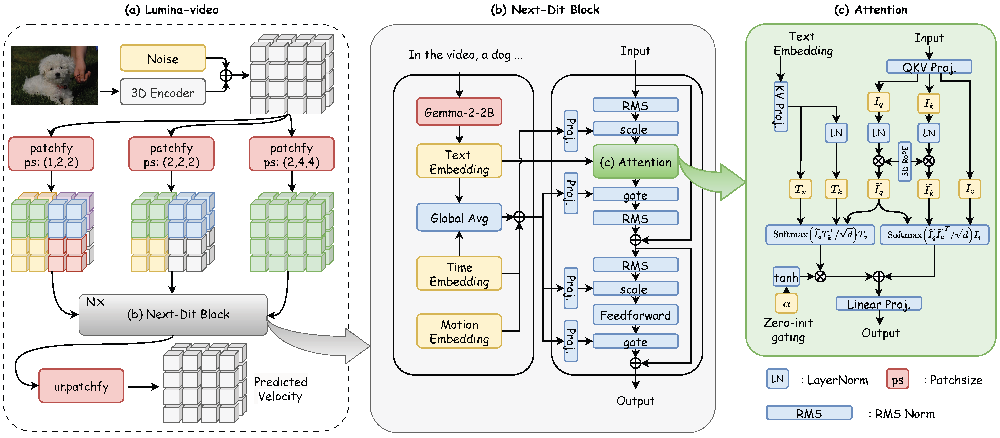

<div align="center">

# Lumina-Video

**Official repository for Lumina-Video, a preliminary tryout of the Lumina series for Video Generation**

</div>


<p align="center">
 
 <br>
</p>

```bash
sudo apt-get update && sudo apt-get install git-lfs ffmpeg cbm

conda create --name py310 python=3.10
conda activate py310
pip install ipykernel
python -m ipykernel install --user --name py310 --display-name "py310"

git clone https://github.com/svjack/Lumina-Video && cd Lumina-Video
pip install -r requirements.txt
pip install imageio flash_attn

huggingface-cli download --resume-download Alpha-VLLM/Lumina-Video-f24R960 --local-dir ./ckpts/f24R960

huggingface-cli login

# Example for generatingan video with 4s duration, fps=24, resolution=1248x704
python -u generate.py \
    --ckpt ./ckpts/f24R960 \
    --resolution 1248x704 \
    --fps 24 \
    --frames 96 \
    --prompt "Joseon Taizong is captured mid-action, drawing a bow with intense focus. He wears a traditional red Korean hanbok adorned with intricate dragon designs, and a black hat with a white circular emblem. The background features a colorful tent with green and red patterns, and the sunlight filters through, casting a warm glow. Two other figures, one partially visible, are dressed in similar traditional attire." \
    --neg_prompt "" \
    --sample_config f24F96R960  # set to "f24F96R960-MultiScale" for efficient multi-scale inference
```


<h2 id="custom-gallery"> 📽️ Gallery</h2>

### Text to Video results

<table border="0" style="width: 100%; text-align: center; margin-top: 1px;">
  <tr>
    <td><video src="https://github.com/user-attachments/assets/97f10a34-a5f6-4c9e-9874-4310a04ca601" width="100%" controls autoplay loop muted></video></td>
    <td><video src="https://github.com/user-attachments/assets/9174a01b-73e7-4920-8674-6610643f959e" width="100%" controls autoplay loop muted></video></td>
    <td><video src="https://github.com/user-attachments/assets/28dd9fd9-dec6-4426-a1ea-3354633ecb4e" width="100%" controls autoplay loop muted></video></td>
  </tr>
  <tr>
    <td><video src="https://github.com/user-attachments/assets/39b909de-1013-4b5f-9212-3882e481aa8a" width="100%" controls autoplay loop muted></video></td>
    <td><video src="https://github.com/user-attachments/assets/7dcd28c9-75c6-4ef3-932c-6097b49154e1" width="100%" controls autoplay loop muted></video></td>
    <td><video src="https://github.com/user-attachments/assets/40a4de3b-27b1-4887-b0e8-b9ccd20ff959" width="100%" controls autoplay loop muted></video></td>
  </tr>
  <tr>
    <td><video src="https://github.com/user-attachments/assets/489a79d0-bfc8-4b2a-800c-fda71d1359f7" width="100%" controls autoplay loop muted></video></td>
    <td><video src="https://github.com/user-attachments/assets/06a3d8f5-666c-4e98-a4aa-42dbb34a4c29" width="100%" controls autoplay loop muted></video></td>
    <td><video src="https://github.com/user-attachments/assets/52075f49-ca11-4d86-8a12-2a9bb6f13714" width="100%" controls autoplay loop muted></video></td>
  </tr>
  <tr>
    <td><video src="https://github.com/user-attachments/assets/e57451f0-7d06-4913-96e3-cbc1db6f8d41" width="100%" controls autoplay loop muted></video></td>
    <td><video src="https://github.com/user-attachments/assets/3c4b763f-b457-42d5-bac3-efe24cb38dc0" width="100%" controls autoplay loop muted></video></td>
    <td><video src="https://github.com/user-attachments/assets/f034d5f7-b99d-4770-81bc-de1e85ac2bc2" width="100%" controls autoplay loop muted></video></td>
  </tr>
</table>

### Text to Video+Audio results

<table border="0" style="width: 100%; text-align: left; margin-top: 15px; border-collapse: collapse;">
  <tr>
      <td>
          <video src="https://github.com/user-attachments/assets/bde89b02-30a7-4f05-a051-5f5bba02d746" width="100%" controls autoplay loop muted></video>
      </td>
      <td>
          <video src="https://github.com/user-attachments/assets/0f1ffa3a-aa79-45ac-99ad-ed8e2dc9ba64" width="100%" controls autoplay loop muted></video>
      </td>
      <td>
          <video src="https://github.com/user-attachments/assets/22119867-bc8b-426a-98ab-39c66984909c" width="100%" controls autoplay loop muted></video>
      </td>
  </tr>
  <tr>
      <td>
          <video src="https://github.com/user-attachments/assets/b8607399-2791-4c38-9836-01958f056c29" width="100%" controls autoplay loop muted></video>
      </td>
      <td>
          <video src="https://github.com/user-attachments/assets/2d268f3a-6a15-4c76-8f8a-f0b3400008ac" width="100%" controls autoplay loop muted></video>
      </td>
      <td>
          <video src="https://github.com/user-attachments/assets/f2357214-a3b4-41f4-8ab6-f3943a961569" width="100%" controls autoplay loop muted></video>
      </td>
  </tr>
</table>

## 📰 News

- **[2025-02-10] 🎉🎉🎉 [Technical Report](./Lumina%20Video%20Report%20V1.pdf) is released! 🎉🎉🎉**
- **[2025-02-09] 🎉🎉🎉 Lumina-Video is released! 🎉🎉🎉**

## ⚙️ Installation

See [INSTALL.md](./INSTALL.md) for detailed instructions.

## 🤗 Checkpoints

**T2V models**

| resolution | fps  | max frames | Huggingface                                                  |
| ---------- | ---- | ---------- | ------------------------------------------------------------ |
| 960        | 24   | 96         | [Alpha-VLLM/Lumina-Video-f24R960](https://huggingface.co/Alpha-VLLM/Lumina-Video-f24R960) |

## ⛽ Inference

### Preparations

Download the checkpoints before continue. You can use the following code to download the checkpoints to the `./ckpts` directory

```
huggingface-cli download --resume-download Alpha-VLLM/Lumina-Video-f24R960 --local-dir ./ckpts/f24R960
```

### Inference

You can quickly run video generation using the command below:


```bash
# Example for generatingan video with 4s duration, fps=24, resolution=1248x704
python -u generate.py \
    --ckpt ./ckpts/f24R960 \
    --resolution 1248x704 \
    --fps 24 \
    --frames 96 \
    --prompt "your prompt here" \
    --neg_prompt "" \
    --sample_config f24F96R960  # set to "f24F96R960-MultiScale" for efficient multi-scale inference
```

#### QAs

**Q1**: Why using the 1248x704 resolution?

**A1**: The resolution is originally expected to be 1280x720. However, to ensure compatibility with the largest patch size
(smallest scale), both the width and height must be divisible by 32. As a result, the resolution is adjusted to
1248x704.

**Q2**: Does the model support flexible aspect ratio?

**A2**: Yes, you can use the following code for checking all usable resolutions

```Python
# Python
from imgproc import generate_crop_size_list

target_size = 960
patch_size = 32
max_num_patches = (target_size // patch_size) ** 2
crop_size_list = generate_crop_size_list(max_num_patches, patch_size)

print(crop_size_list)
```

## Training

### Preparations

Before starting the training process, two preparation steps are required to optimize training efficiency and enable motion conditioning:

1. **Pre-extract and cache VAE latents for video data**: This significantly enhances training speed.
2. **Compute motion scores for videos**: These are used for micro-conditioning input during training.

#### Pre-Extract VAE Latents

The code for pre-extracting and caching VAE latents can be found in the [./tools/pre_extract](tools/pre_extract) directory. For an example of how to run this, refer to the [run.sh](tools/pre_extract/scripts/run.sh) script.

#### Compute Motion Score

We use UniMatch to estimate optical flow, with the average optical flow serving as the motion score. This code is primarily derived from [Open-Sora](https://github.com/hpcaitech/Open-Sora/tree/main/tools/scoring/optical_flow), and we'd like to thank them for their excellent work!

The code for computing motion scores is available in the [./tools/unimatch](tools/unimatch) directory. To see how to run it, refer to the [run.sh](tools/unimatch/scripts/run.sh) script.

### Training

Once the data has been prepared, you're ready to start training! For an example, you can refer to the [training directory](train_exps/f8F32R256), which demonstrates how to train with:

- **FPS**: 8
- **Duration**: 4 seconds
- **Resolution**: widthxheight≈256x256
- **Training Techniques**: Image-text joint training and multi-scale training applied together.


## 📑 Open-source Plan

- [X] Inference code
- [X] Training code
